# 🧬 Deep-AmPEP30 項目全面入職指南

> **文件版本**: v1.0 | **最後更新**: 2026-02-07 | **目標讀者**: 新加入的 Full-Stack 工程師
>
> 本文件由技術主管角度撰寫，旨在幫助新團隊成員在最短時間內全面了解 Deep-AmPEP30 項目的**業務背景、技術架構、代碼結構與開發流程**。

---

## 📋 目錄

1. [項目概述與業務背景](#1-項目概述與業務背景)
2. [問題定義與第一性原理分析](#2-問題定義與第一性原理分析)
3. [系統總體架構](#3-系統總體架構)
4. [技術棧詳解](#4-技術棧詳解)
5. [機器學習管線深度解析](#5-機器學習管線深度解析)
6. [特徵工程核心算法](#6-特徵工程核心算法)
7. [API 微服務設計](#7-api-微服務設計)
8. [目錄結構與代碼地圖](#8-目錄結構與代碼地圖)
9. [數據集說明](#9-數據集說明)
10. [部署架構與 DevOps](#10-部署架構與-devops)
11. [開發環境設定指南](#11-開發環境設定指南)
12. [效能指標與基準測試](#12-效能指標與基準測試)
13. [常見問題與排錯指引](#13-常見問題與排錯指引)
14. [未來發展路線圖](#14-未來發展路線圖)

---

## 1. 項目概述與業務背景

### 🎯 一句話總結

> **Deep-AmPEP30 是一個基於深度學習和隨機森林的抗菌肽（AMP）預測系統，能夠從蛋白質序列中高效判斷短肽（5-30 個氨基酸）是否具有抗菌活性。**

### 🌍 業務背景

| 項目 | 說明 |
|------|------|
| **所屬組織** | AxPEP 研究團隊 |
| **學術論文** | *"Deep-AmPEP30: Improve Short Antimicrobial Peptides Prediction with Deep Learning"* (Molecular Therapy - Nucleic Acids, 2020) |
| **論文作者** | Yan, J.; Bhadra, P.; Li, A.; Sethiya, P.; Qin, L.; Tai, H. K.; Wong, K. H.; Siu, Shirley W. I. |
| **應用場景** | 作為 AxPEP 網站伺服器的核心預測引擎 |
| **終端使用者** | 生物信息學研究人員、藥物開發科學家、微生物學家 |

### 🧫 什麼是抗菌肽（AMP）？

抗菌肽（Antimicrobial Peptides, AMPs）是天然存在的短蛋白質片段，具有殺滅或抑制微生物（細菌、真菌、病毒等）的能力。在抗生素耐藥性日益嚴重的今天，AMPs 被視為下一代抗菌藥物的重要候選者。

```
🦠 傳統抗生素    →  耐藥性問題日益嚴重
🧬 抗菌肽 (AMP)  →  天然、廣譜、不易產生耐藥性
🤖 本項目的價值   →  用 AI 加速 AMP 發現，降低實驗成本
```

---

## 2. 問題定義與第一性原理分析

### 🔬 從第一性原理思考

用 Elon Musk 的第一性原理方法拆解這個問題：

```
❓ 根本問題：如何快速、準確地判斷一個短肽序列是否具有抗菌活性？

📌 傳統方法：實驗室合成 → 體外測試 → 確認活性
   ⏰ 耗時：數天到數週
   💰 成本：每條肽序列需要數百美元
   📊 通量：每天只能測試數十條

📌 AI 方法（本項目）：序列輸入 → 特徵提取 → 模型預測 → 秒級結果
   ⏰ 耗時：< 1 秒/條序列
   💰 成本：幾乎為零（計算成本）
   📊 通量：每秒可處理數千條序列
```

### 核心假設

1. **氨基酸組成反映功能**：AMP 的抗菌活性與其氨基酸組成特徵密切相關
2. **理化性質分群有效**：將 20 種氨基酸按理化性質分組後，能更好地捕捉與抗菌活性相關的模式
3. **短肽的特殊性**：5-30 個氨基酸的短肽有其獨特的序列特徵，需要專門的預測方法

---

## 3. 系統總體架構

### 三層架構概覽

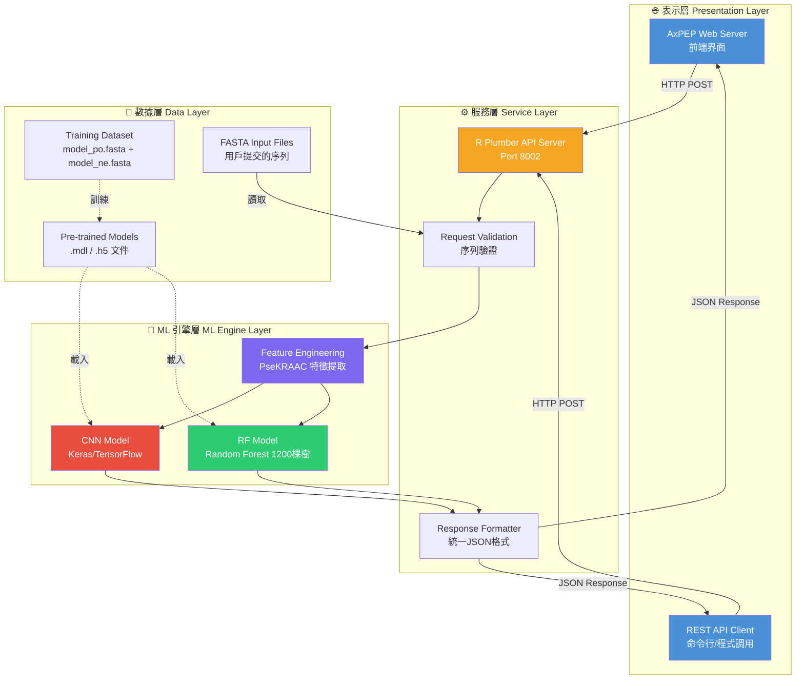

### 端到端數據流

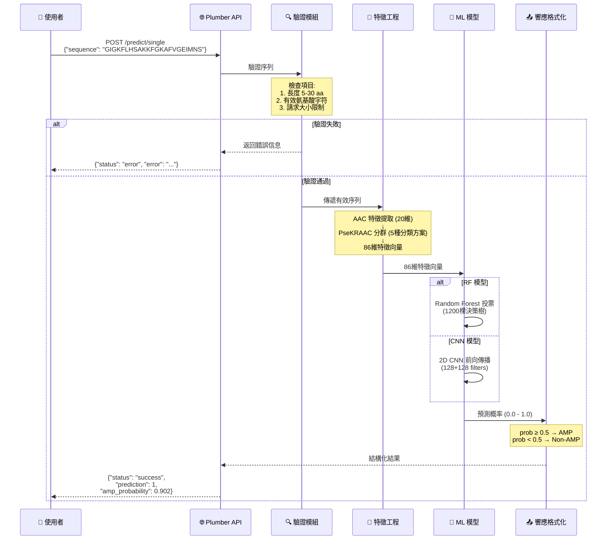

---

## 4. 技術棧詳解

### 技術棧全景圖

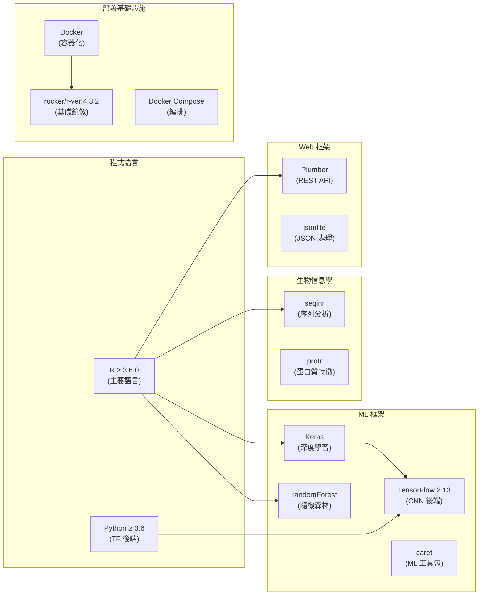

### 關鍵依賴一覽表

| 類別 | 套件/工具 | 用途 | 版本要求 |
|------|-----------|------|----------|
| **核心語言** | R | 主要開發語言 | ≥ 3.6.0 |
| **深度學習** | keras / kerasR | CNN 模型構建與推理 | - |
| **深度學習後端** | TensorFlow | CNN 計算引擎 | 2.13 |
| **隨機森林** | randomForest | RF 模型 | - |
| **ML 工具** | caret | 交叉驗證、數據分割 | - |
| **序列分析** | seqinr | FASTA 讀取、序列處理 | - |
| **蛋白質特徵** | protr | AAC 特徵提取 | - |
| **效能評估** | ROCR | ROC/AUC 計算 | - |
| **Python 介面** | reticulate | R 調用 Python/TF | - |
| **Web 框架** | plumber | REST API 服務 | - |
| **JSON** | jsonlite | JSON 序列化/反序列化 | - |
| **容器** | Docker | 容器化部署 | - |

---

## 5. 機器學習管線深度解析

### ML Pipeline 全流程

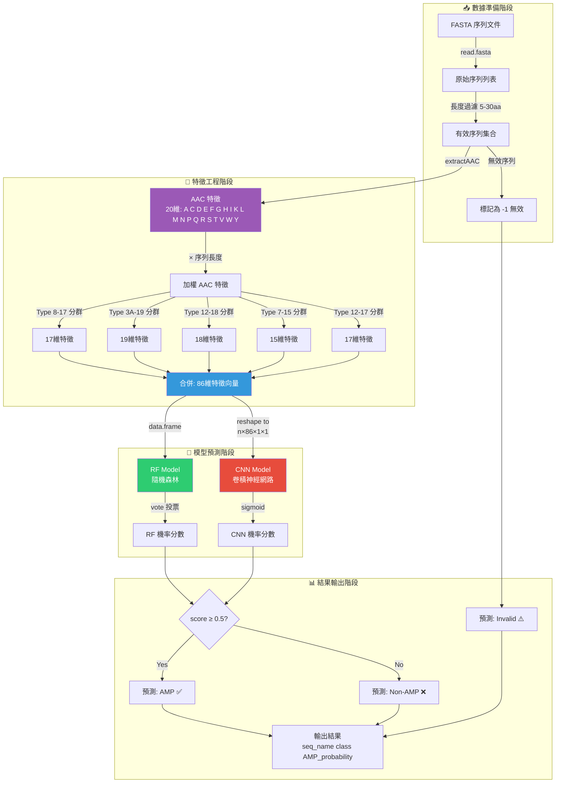

### CNN 模型架構詳解

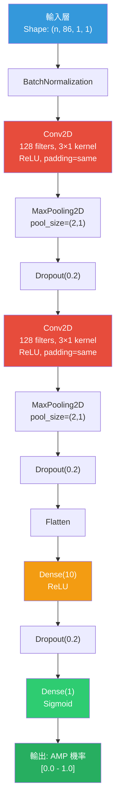

### CNN 訓練參數

| 參數 | 值 | 說明 |
|------|-----|------|
| **Optimizer** | RMSprop | 學習率 = 0.00025 |
| **Loss Function** | Binary Crossentropy | 二元分類交叉熵 |
| **Batch Size** | 64 | 每批次樣本數 |
| **Epochs** | 100 | 訓練輪數 |
| **Cross Validation** | 10-fold | 交叉驗證（無獨立測試集時） |
| **Dropout Rate** | 0.2 | 正則化率 |

### Random Forest 模型配置

| 參數 | 值 | 說明 |
|------|-----|------|
| **ntree** | 1,200 | 決策樹數量 |
| **mtry** | 1 | 每次分裂特徵數 |
| **Cross Validation** | 10-fold | 交叉驗證 |
| **Proximity** | TRUE | 計算樣本相似度 |

---

## 6. 特徵工程核心算法

### PseKRAAC 特徵提取原理

PseKRAAC（Pseudo K-tuple Reduced Amino Acid Composition）是本項目的核心創新。其原理是將 20 種標準氨基酸按照**理化性質**分成不同的群組，從而捕捉更高層次的序列特徵。

### 五種氨基酸分類方案

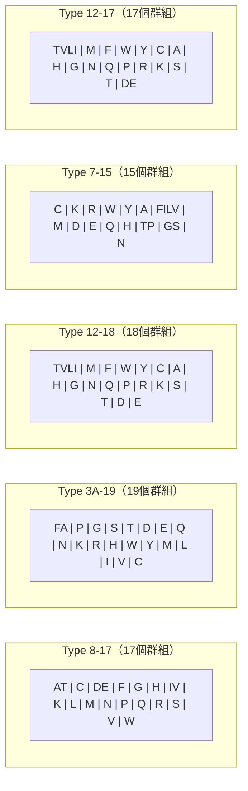

### 特徵提取流程演算

以序列 `GIGKFLHSAKKFGKAFVGEIMNS`（Magainin-2, 23aa）為例：

```
步驟 1: AAC 提取 (20維)
─────────────────────
計算每種氨基酸的頻率 × 序列長度:
  G: 3次 → (3/23) × 23 = 3.0
  I: 2次 → (2/23) × 23 = 2.0
  K: 3次 → (3/23) × 23 = 3.0
  F: 2次 → (2/23) × 23 = 2.0
  ...其他氨基酸類推
  → 生成 [A, C, D, E, F, G, H, I, K, L, M, N, P, Q, R, S, T, V, W, Y] 共 20個值

步驟 2: PseKRAAC 分群 (86維)
─────────────────────────
Type 8-17 的 "AT" 群組:
  → AAC[A] + AAC[T] = 2.0 + 0.0 = 2.0 (合併同群氨基酸的值)
  
Type 8-17 的 "DE" 群組:
  → AAC[D] + AAC[E] = 0.0 + 1.0 = 1.0
  
Type 7-15 的 "FILV" 群組:
  → AAC[F] + AAC[I] + AAC[L] + AAC[V] = 2.0 + 2.0 + 1.0 + 1.0 = 6.0

...對 5 種分類方案的所有群組重複此過程
→ 最終得到 17 + 19 + 18 + 15 + 17 = 86 維特徵向量
```

### 為什麼這個方法有效？

```
🧪 生物學直覺:
├── 抗菌肽通常具有「兩親性」結構
│   ├── 疏水面: F, I, L, V 等疏水氨基酸聚集
│   └── 親水面: K, R 等帶正電氨基酸聚集
│
├── PseKRAAC 分群恰好按理化性質聚合
│   ├── Type 7-15 的 "FILV" = 疏水氨基酸群
│   └── Type 8-17 的 "K" 和 "R" = 正電氨基酸
│
└── 多種分群方案從不同角度捕捉特徵
    └── 5種最佳方案的組合 > 單一方案的效果
```

---

## 7. API 微服務設計

### API 端點總覽

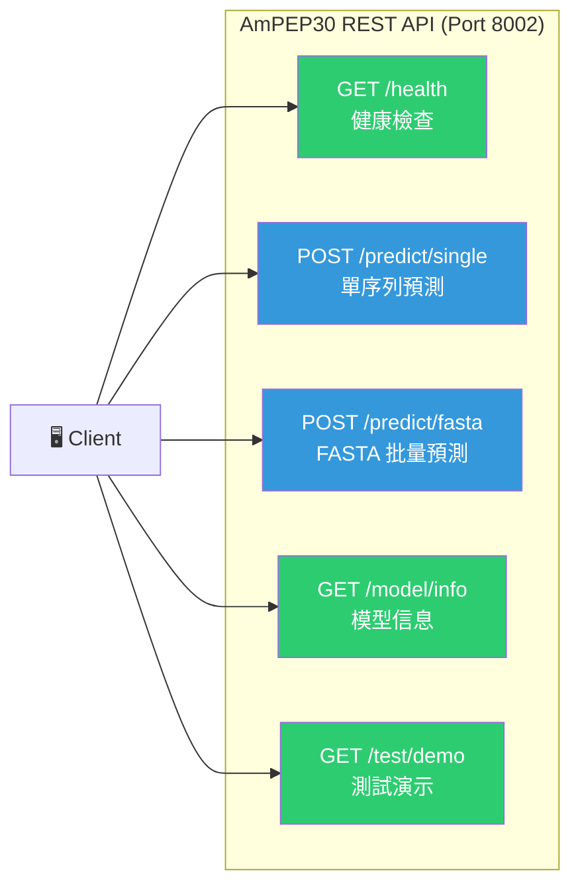

### API 端點詳細規格

#### `GET /health` — 健康檢查

```json
// Response
{
  "status": "healthy",
  "service": "AmPEP30-Final-API",
  "version": "1.0.0",
  "timestamp": "2026-02-07T12:00:00+0000"
}
```

#### `POST /predict/single` — 單序列預測

```json
// Request
{
  "sequence": "GIGKFLHSAKKFGKAFVGEIMNS",  // 必填: 5-30 個氨基酸
  "name": "Magainin-2",                    // 選填: 序列名稱
  "method": "rf",                          // 選填: "rf" 或 "cnn"
  "precision": 3                           // 選填: 小數位數 0-6
}

// Success Response
{
  "sequence_name": "Magainin-2",
  "sequence": "GIGKFLHSAKKFGKAFVGEIMNS",
  "length": 23,
  "prediction": 1,                    // 1=AMP, 0=Non-AMP
  "amp_probability": 0.902,
  "non_amp_probability": 0.098,
  "confidence": 0.902,
  "model_used": "rf",
  "interpretation": "此序列很可能是抗菌胜肽 (機率: 90.2%)",
  "status": "success"
}

// Error Response（統一格式）
{
  "sequence_name": "query",
  "sequence": "AB",
  "length": 2,
  "prediction": null,
  "amp_probability": null,
  "non_amp_probability": null,
  "confidence": null,
  "model_used": "rf",
  "error": "序列長度必須在 5-30 氨基酸之間，當前長度: 2",
  "status": "error"
}
```

#### `POST /predict/fasta` — FASTA 批量預測

```json
// Request
{
  "fasta_content": ">seq1\nGLFDIVKKVVGALGSL\n>seq2\nALWKTMLKKLGTMALH",
  "method": "rf",
  "precision": 3
}

// Response
{
  "total_sequences": 2,
  "successful_predictions": 2,
  "failed_predictions": 0,
  "results": [...],
  "status": "success"
}
```

### 統一響應格式設計

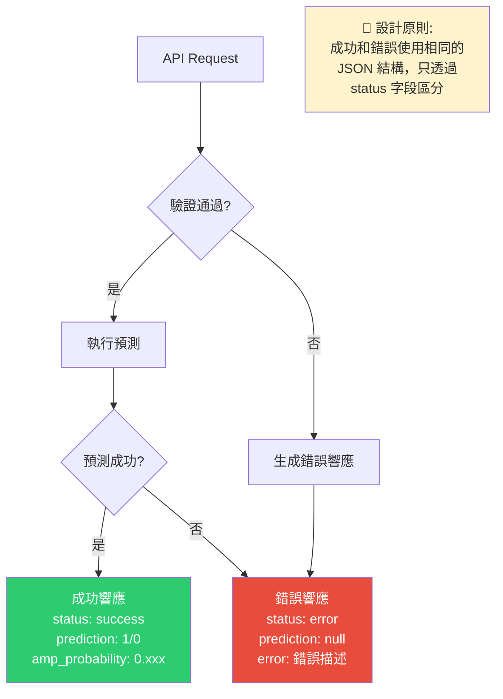

### 輸入驗證規則

| 規則 | 值 | 說明 |
|------|-----|------|
| **最小序列長度** | 5 | 少於 5 個氨基酸：拒絕 |
| **最大序列長度** | 30 | 超過 30 個氨基酸：拒絕 |
| **允許的氨基酸** | `ACDEFGHIKLMNPQRSTVWY` | 20 種標準氨基酸 |
| **最大請求大小** | 10 MB | 防止過大請求 |
| **最大序列數/請求** | 100 | 批量預測上限 |
| **API 超時** | 3600 秒 | 批量處理容許長時間 |

---

## 8. 目錄結構與代碼地圖

### 項目目錄結構

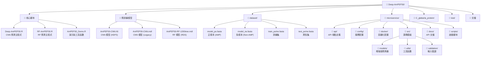

### 關鍵文件說明

| 文件路徑 | 功能 | 重要性 |
|----------|------|--------|
| `Deep-AmPEP30.R` | CNN 模型的特徵工程 + 訓練 + 預測完整實現 | ⭐⭐⭐⭐⭐ |
| `RF-AmPEP30.R` | RF 模型的特徵工程 + 訓練 + 預測完整實現 | ⭐⭐⭐⭐⭐ |
| `AmPEP30_Demo.R` | 演示腳本，含 `predict_peptide()` 便利函數 | ⭐⭐⭐⭐ |
| `AmPEP30-RF-1200tree.mdl` | 預訓練的 RF 模型文件（RDS 格式） | ⭐⭐⭐⭐⭐ |
| `AmPEP30-CNN.h5` | 預訓練的 CNN 模型文件（HDF5 格式） | ⭐⭐⭐⭐⭐ |
| `microservice/api/ampep30_final_api.R` | 生產 API 端點定義（正式版） | ⭐⭐⭐⭐ |
| `microservice/config/config.R` | 服務配置（路徑、端口、特性開關等） | ⭐⭐⭐ |
| `microservice/docker/Dockerfile` | Docker 構建配置 | ⭐⭐⭐ |
| `microservice/docker/docker-compose.yml` | 容器編排配置 | ⭐⭐⭐ |
| `microservice/src/models/ampep_predictor.R` | 增強版預測器（含緩存、降級機制） | ⭐⭐⭐ |
| `microservice/src/validation/fasta_validator.R` | FASTA 格式驗證器 | ⭐⭐ |
| `microservice/src/utils/helpers.R` | 日誌、請求清潔、錯誤處理工具 | ⭐⭐ |
| `dataset/model_po.fasta` | 正樣本訓練數據（~1,649 條 AMP 序列） | ⭐⭐⭐⭐ |
| `dataset/model_ne.fasta` | 負樣本訓練數據（~1,649 條 Non-AMP 序列） | ⭐⭐⭐⭐ |

### 核心函數導航地圖

```
Deep-AmPEP30.R / RF-AmPEP30.R (共用函數)
├── read_seq()              → 讀取 FASTA 文件，過濾 5-30aa 序列
├── print_error_seqs()      → 識別不符合長度要求的序列
├── read_pn()               → 讀取正/負樣本數據對
├── gene_aac()              → 提取 AAC 特徵（20維）
├── gene_ftdata()           → 生成訓練特徵矩陣
├── totally_psekraac_best5()→ ⭐ 核心特徵工程函數（86維 PseKRAAC）
│
├── rf_yan_predict()        → RF 模型預測入口
├── cnn_yan_predict()       → CNN 模型預測入口
│
├── rf_yan()                → RF 模型訓練函數
├── cnn_yan_binary()        → CNN 模型訓練函數
├── develop_cnn_mdl_yan()   → 模型開發/訓練入口
└── cal_mat()               → 計算評估指標（ACC、AUC、MCC等）

AmPEP30_Demo.R
└── predict_peptide()       → 高層便利函數（單序列預測）

microservice/api/ampep30_final_api.R
├── /health                 → 健康檢查端點
├── /predict/single         → 單序列預測端點
├── /predict/fasta          → FASTA 批量預測端點
├── normalize_method()      → 方法參數標準化
└── normalize_precision()   → 精度參數標準化
```

---

## 9. 數據集說明

### 數據集組成

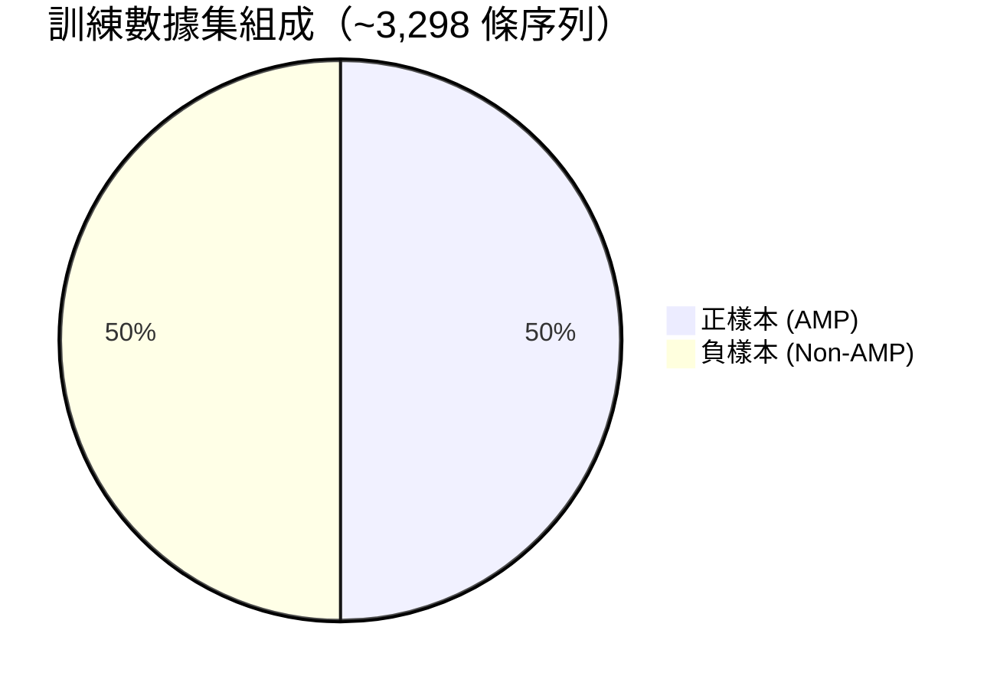

### 數據集文件對應

| 文件 | 類型 | 樣本數 | 用途 |
|------|------|--------|------|
| `dataset/model_po.fasta` | 正樣本 (AMP) | ~1,649 | 模型訓練 |
| `dataset/model_ne.fasta` | 負樣本 (Non-AMP) | ~1,649 | 模型訓練 |
| `dataset/train_po.fasta` | 正樣本 (AMP) | - | 訓練子集 |
| `dataset/train_ne.fasta` | 負樣本 (Non-AMP) | - | 訓練子集 |
| `dataset/test_po.fasta` | 正樣本 (AMP) | - | 測試子集 |
| `dataset/test_ne.fasta` | 負樣本 (Non-AMP) | - | 測試子集 |
| `dataset/s2.fasta` | 混合 | - | 額外測試 |

### 序列格式 (FASTA)

```
>amp5_30_1
ACSAG
>amp5_30_2
AMVGT
>amp5_30_3
AMVSS
```

- 每條序列由 `>` 開頭的描述行和序列行組成
- 序列長度範圍：5-30 個氨基酸
- 氨基酸字母表：`A C D E F G H I K L M N P Q R S T V W Y`（20種標準氨基酸）

---

## 10. 部署架構與 DevOps

### 部署架構圖

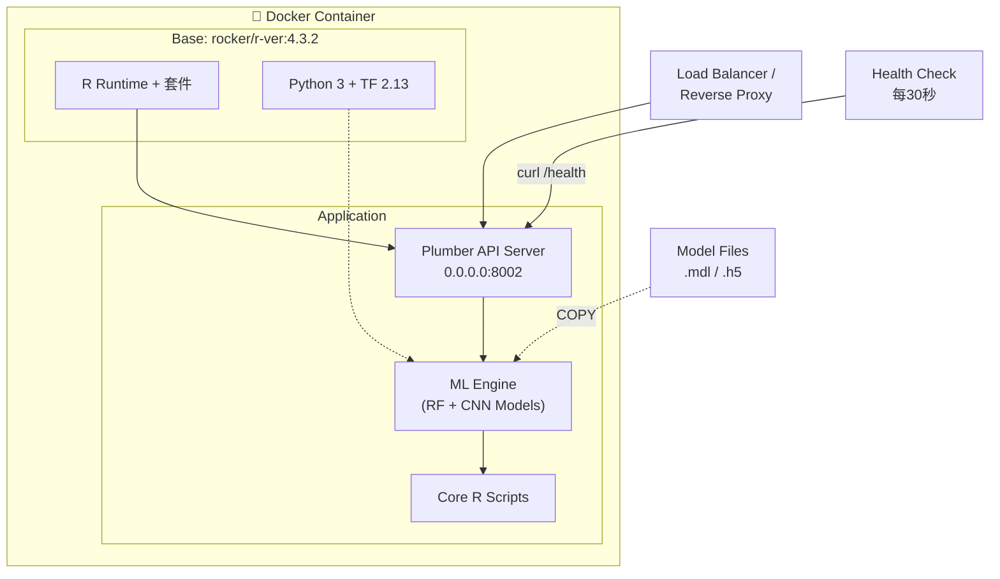

### Docker Compose 配置解析

```yaml
# 關鍵配置說明
services:
  deep-ampep30:
    ports: "8002:8002"           # 主機端口:容器端口
    environment:
      - ENABLE_RF=true           # ✅ RF 模型啟用（推薦）
      - ENABLE_CNN=false         # ❌ CNN 模型停用（需 TF，資源較重）
      - DEFAULT_METHOD=rf        # 預設使用 RF
    healthcheck:
      interval: 30s             # 每 30 秒檢查一次
      start_period: 60s         # 啟動後 60 秒才開始檢查
    restart: unless-stopped      # 崩潰自動重啟
```

### 環境變數配置表

| 變數名 | 默認值 | 說明 |
|--------|--------|------|
| `APP_ROOT` | `/app` | 應用根目錄 |
| `PLUMBER_HOST` | `0.0.0.0` | 綁定地址 |
| `PLUMBER_PORT` | `8002` | 服務端口 |
| `ENABLE_RF` | `true` | 啟用 RF 模型 |
| `ENABLE_CNN` | `false` | 啟用 CNN 模型 |
| `DEFAULT_METHOD` | `rf` | 默認預測方法 |
| `R_LOG_LEVEL` | `INFO` | 日誌級別 |
| `MAX_SEQUENCES_PER_REQUEST` | `100` | 每請求最大序列數 |
| `RETICULATE_PYTHON` | `/usr/bin/python3` | Python 路徑（用於 TF） |

---

## 11. 開發環境設定指南

### 🖥️ 本地開發（無 Docker）

```bash
# 1. 克隆倉庫
git clone <repo-url>
cd Deep-AmPEP30

# 2. 安裝 R 依賴
R -e "install.packages(c('seqinr', 'caret', 'randomForest', 'ROCR', 'protr', 'plumber', 'jsonlite'))"

# 3. （可選）安裝 CNN 依賴
R -e "install.packages(c('keras', 'reticulate'))"
# Python 端: pip install tensorflow==2.13.0 h5py numpy

# 4. 驗證 RF 模型可用
Rscript RF-AmPEP30.R test.fasta test_output.txt
cat test_output.txt

# 5. 運行演示
Rscript AmPEP30_Demo.R

# 6. 啟動 API 服務（本地）
R -e "pr <- plumber::plumb('microservice/api/ampep30_final_api.R'); pr\$run(host='0.0.0.0', port=8001)"
```

### 🐳 Docker 開發

```bash
# 方式一：Docker Compose（推薦）
docker compose -f microservice/docker/docker-compose.yml up --build

# 方式二：手動 Docker
docker build -f microservice/docker/Dockerfile -t deep-ampep30 .
docker run --rm -p 8002:8002 deep-ampep30

# 測試 API
curl http://localhost:8002/health
curl -X POST "http://localhost:8002/predict/single" \
  -H "Content-Type: application/json" \
  -d '{"sequence": "GIGKFLHSAKKFGKAFVGEIMNS"}'
```

### 快速驗證清單

- [ ] `Rscript RF-AmPEP30.R test.fasta output.txt` → 有輸出結果
- [ ] `Rscript AmPEP30_Demo.R` → 演示運行成功
- [ ] `curl http://localhost:8002/health` → 回傳 `"healthy"`
- [ ] `POST /predict/single` 帶有效序列 → 回傳預測結果

---

## 12. 效能指標與基準測試

### 模型準確率

| 指標 | CNN 模型 | RF 模型 |
|------|----------|---------|
| **準確率 (Accuracy)** | ~75% | ~75% |
| **正樣本錯誤率** | ~5.9% | ~5.9% |
| **UniProt Non-AMP 測試** | 75.4% | 75.4% |

### 計算性能（10,000 條序列基準測試）

```mermaid
gantt
    title 處理效能基準（10,000條序列）
    dateFormat X
    axisFormat %s秒

    section 特徵生成
    PseKRAAC 特徵提取     :0, 1

    section RF 模型
    RF 訓練 (3298序列)    :0, 28
    RF 預測 (10000序列)   :0, 23

    section CNN 模型
    CNN 訓練 (3298序列)   :0, 198
    CNN 預測 (10000序列)  :0, 22
```

| 操作 | 耗時 | 說明 |
|------|------|------|
| **特徵生成** | 0.52 ± 0.02 秒 | 10,000 條序列 |
| **RF 訓練** | 28.1 ± 0.3 秒 | 3,298 條訓練序列 |
| **CNN 訓練** | 197.5 ± 0.8 秒 | 3,298 條訓練序列 |
| **RF 預測** | ~23 秒 | 10,000 條序列 |
| **CNN 預測** | ~22 秒 | 10,000 條序列 |
| **單序列預測** | < 1 秒 | 包含特徵提取 |

---

## 13. 常見問題與排錯指引

### ❓ FAQ

<details>
<summary><b>Q: 為什麼預設使用 RF 而非 CNN？</b></summary>

RF 模型不需要 TensorFlow/Python 依賴，啟動更快、佔用資源更少，且預測準確率與 CNN 接近。CNN 主要用於學術研究對比。
</details>

<details>
<summary><b>Q: 為什麼序列長度限制在 5-30 個氨基酸？</b></summary>

這是論文設計的限制。短於 5aa 的序列特徵太少，不足以做出可靠預測；長於 30aa 的肽段已超出本模型的訓練範圍。如需預測更長序列，請使用其他工具如 AmPEP。
</details>

<details>
<summary><b>Q: 序列中出現非標準氨基酸怎麼辦？</b></summary>

系統只接受 20 種標準氨基酸（ACDEFGHIKLMNPQRSTVWY）。如果序列中包含 B、J、O、U、X、Z 等非標準字母，會被拒絕並返回錯誤。
</details>

<details>
<summary><b>Q: prediction 返回 -1 是什麼意思？</b></summary>

-1 表示序列長度不在 5-30 範圍內，被標記為無效序列。
</details>

### 🔧 常見錯誤排解

| 錯誤 | 原因 | 解決方案 |
|------|------|----------|
| `Model file not found` | 模型文件路徑錯誤 | 確認 `.mdl`/`.h5` 文件存在於項目根目錄 |
| `TensorFlow not found` | CNN 缺少 Python 依賴 | 安裝 TF：`pip install tensorflow==2.13.0` |
| `Package 'seqinr' not found` | R 套件未安裝 | `install.packages('seqinr')` |
| `Invalid amino acids` | 序列含非標準字符 | 檢查序列只包含 ACDEFGHIKLMNPQRSTVWY |
| `Port already in use` | 端口被佔用 | 更改 `PLUMBER_PORT` 環境變數 |

---

## 14. 未來發展路線圖

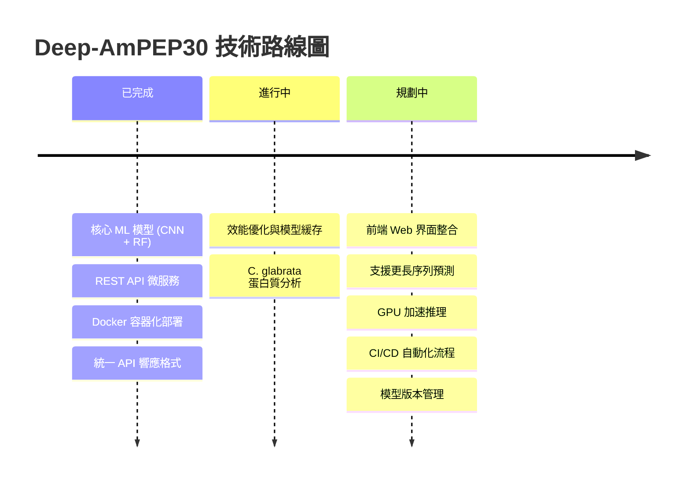

---

## 📎 附錄

### A. 已知 AMP 測試序列

| 名稱 | 序列 | 來源 | 預期 AMP 機率 |
|------|------|------|---------------|
| Magainin-2 | `GIGKFLHSAKKFGKAFVGEIMNS` | 青蛙 | ~90.2% |
| Melittin | `GIGAVLKVLTTGLPALISWIKRKRQQ` | 蜜蜂毒液 | ~74.8% |

### B. 快速測試命令

```bash
# 健康檢查
curl http://localhost:8002/health

# 單序列預測
curl -X POST "http://localhost:8002/predict/single" \
  -H "Content-Type: application/json" \
  -d '{"sequence": "GIGKFLHSAKKFGKAFVGEIMNS", "name": "Magainin-2"}'

# 批量預測
curl -X POST "http://localhost:8002/predict/fasta" \
  -H "Content-Type: application/json" \
  -d '{"fasta_content": ">Magainin-2\nGIGKFLHSAKKFGKAFVGEIMNS\n>Melittin\nGIGAVLKVLTTGLPALISWIKRKRQQ"}'
```

### C. 學術引用

```bibtex
@article{yan2020deep,
  title={Deep-AmPEP30: Improve Short Antimicrobial Peptides Prediction with Deep Learning},
  author={Yan, Jici and Bhadra, Pratiti and Li, Ang and Sethiya, Pooja and Qin, Longguang and Tai, Hio Kuan and Wong, Koon Ho and Siu, Shirley Weng In},
  journal={Molecular Therapy - Nucleic Acids},
  volume={20},
  pages={882--894},
  year={2020},
  publisher={Elsevier}
}
```

---

> 📝 **維護說明**: 本文件應隨項目更新而同步維護。如有任何疑問，請聯繫技術主管或查閱 `microservice/docs/` 目錄下的詳細文檔。
